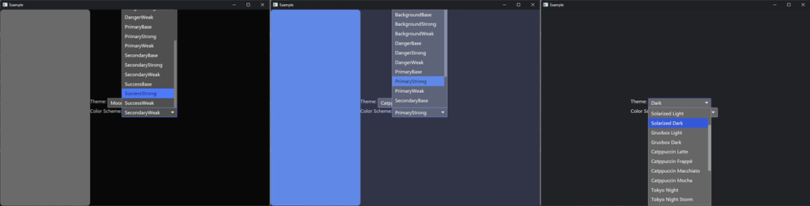

# Iced - Nova Widgets Library

[](https://github.com/iced-rs/iced/blob/master/LICENSE)

This crate contains additional widgets for the GUI library [Iced](https://github.com/hecrj/iced).

## Intro

The project started when I decided to write a desktop application to learn Rust. To be honest, I have a longer way to
go. Anyway, after taking a look at the several GUI libraries available, I decided to stick with Iced. However, I miss a
few widgets and helpers to achieve my desired look and feel.

The development of the library will continue to be developed in parallel with my other application, which also
uses [iced_aw](https://github.com/iced-rs/iced_aw/), so additional widgets will be added as needed.

## Key features:

- Native Rust and Iced implementation
- Native support for Iced themes
- Uses template-defined color patterns (e.g., background, foreground, primary).
- Avoids hardcoding specific color values for greater adaptability.
- Ensures consistency with the current theme or style of the interface.

## Usage

Include `iced_aw` as a dependency in your `Cargo.toml`:

```toml
[dependencies]
iced = "0.13.1"
iced_nova = "0.0.1"
```

## Widgets

### Rectangle



This component renders a rectangle by leveraging the color patterns defined in the template (e.g., background, primary,
or accent colors) instead of using absolute color values. It inherits the template's theme, ensuring a consistent
appearance across different UI elements. By relying on these theme-defined colors, the component remains flexible and
visually cohesive within the broader interface design.